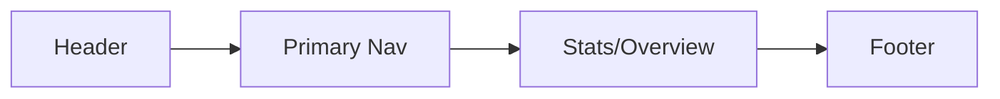
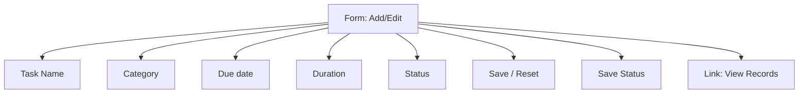
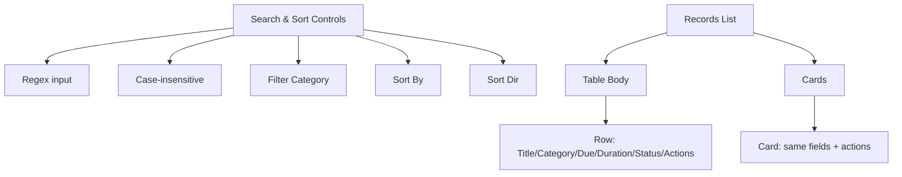
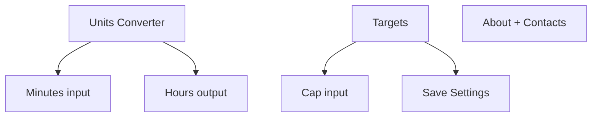
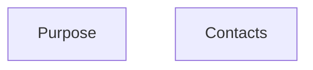

# Campus Life Planner – Wireframe

## Overview
High-level wireframes capturing pages, navigation, core UI blocks, and key flows.

## Sitemap
```mermaid
flowchart TD
  A[Dashboard (index.html)] --> B[Records (records.html)]
  A --> C[View Records (view-records.html)]
  A --> D[Settings (settings.html)]
  A --> E[About (about.html)]
  B --> C
  D --> E
```

## Primary User Flows
- **Add Task -> See It Listed**
  1. Open `records.html`.
  2. Fill form: `Task Name`, `Category`, `Due date`, `Duration`, `Status`.
  3. Submit -> saves via `scripts/storage.js` (`clp:data:v1`) -> redirect to `view-records.html`.
  4. `view-records.html` loads and displays saved record(s).

- **Delete/Edit Task**
  1. On `view-records.html`, click Delete -> remove and persist.
  2. Click Edit -> navigates to `records.html` with record prefilled (via query params).

## Page Wireframes (Blocks)

### Dashboard (`index.html`)
- Header: Title + Nav (Dashboard, Records, View Records, Settings, About)
- Main: Stats/Overview (from `scripts/dashboard.js`), quick links
- Footer: year



### Records (`records.html`)
- Form (Add/Edit):
  - Inputs: `Task Name`, `Category`, `Due date`, `Duration`, `Status`
  - Actions: `Save`, `Reset`
  - Status message area
- Link: Go to View Records



### View Records (`view-records.html`)
- Controls:
  - Search (regex, case-insensitive toggle)
  - Filter by Category
  - Sort (by Due date/Title/Duration) + direction toggle
- Records list:
  - Table view (`#records-tbody`)
  - Cards view (`#records-cards`)
  - Each item: Title, Category, Due, Duration, Status, Actions (Edit/Delete)



### Settings (`settings.html`)
- Units Converter: Minutes -> Hours (live update)
- Targets: Weekly duration cap (save to settings)
- About: Brief text + contact links



### About (`about.html`)
- Purpose blurb
- Contact links: Gmail and GitHub



## Key Data
- Records stored in localStorage under `clp:data:v1` via `scripts/storage.js`.
- Settings stored in localStorage under `clp:settings:v1`.

## Components / IDs of Interest
- Records form IDs: `#record-form-inline`, `#i-title`, `#i-tag`, `#i-dueDate`, `#i-duration`, `#i-status`, `#save-status`.
- View Records controls: `#search-input`, `#search-ci`, `#filter-cat`, `#sort-by`, `#sort-dir`, `#records-tbody`, `#records-cards`.
- Settings: `#conv-min`, `#conv-hr`, `#cap`, `#settings-form`.

## Notes
- Regex search: compiled in `scripts/search.js`; highlighting applied when regex valid.
- Edit navigates with query params to `records.html` to prefill.
- Deletion persists immediately using `save()` from `scripts/storage.js`.
