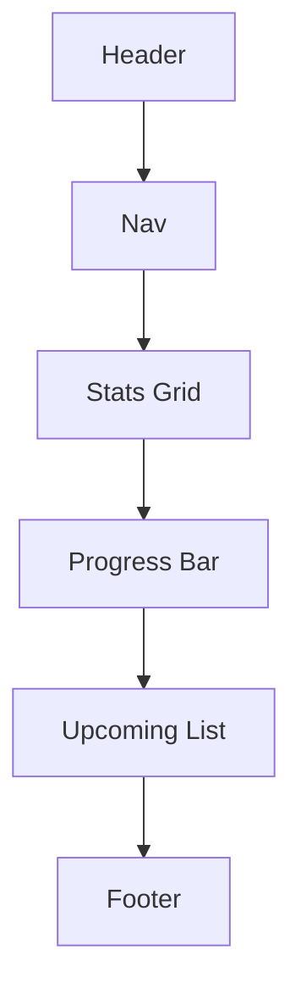
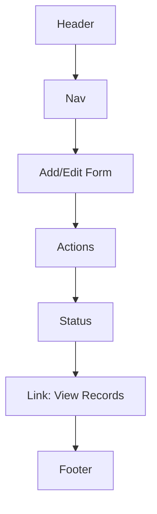
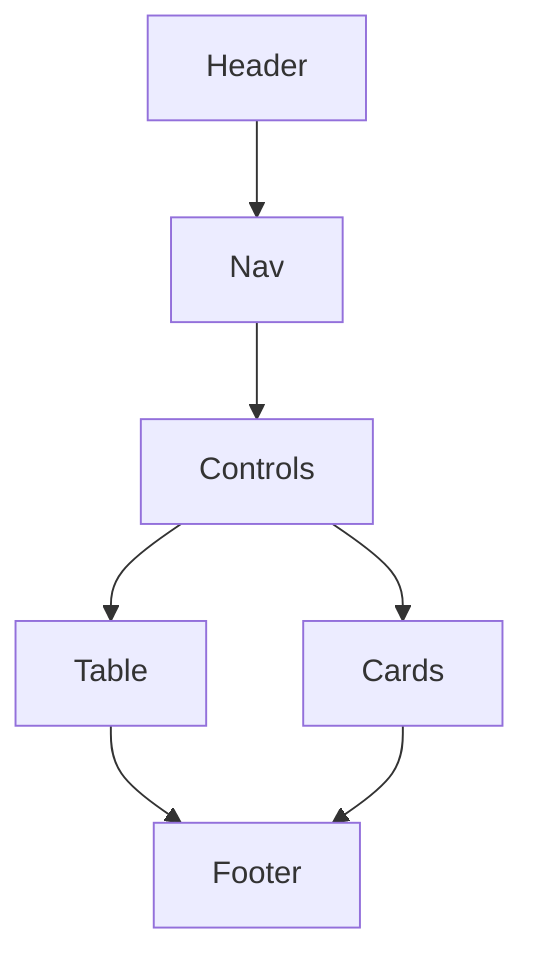

# Campus Life Planner — Simple Wireframe

## Dashboard (index.html)


## Records (records.html)


## View Records (view-records.html)


## Settings (settings.html)
```mermaid
flowchart TD
  H[Header]
  N[Nav]
  U[Units Converter]
  T[Targets (Cap)]
  AB[About Section]
  F[Footer]

  
